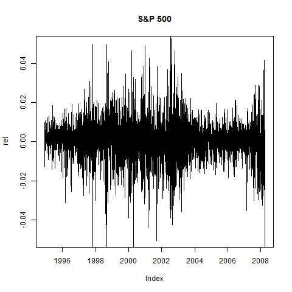
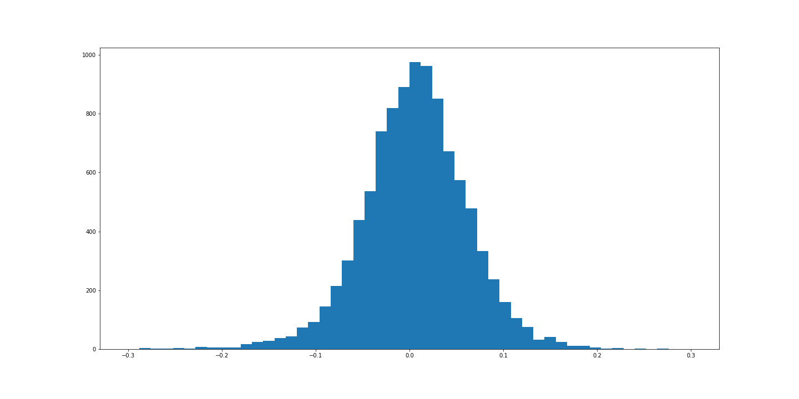

#Introduction
Investors often fail to account for risks included in their portfolios when things are going well. This was a major issue prior to the 2008 global financial crisis, and the crisis reminded many of the importance of evaluating risk. This was most apparent for investment banks that experienced large losses as a result of some risky assets in their portfolios that were not properly accounted for. Because of the importance of banks in our economy, there are regulations in place that require banks to stress-test their portfolios to evaluate the risk exposure.

Since financial data is not i.i.d. normal, it can be difficult to account for the periods of volatily when something such as the 2008 financial crisis occurs. In this paper, I intend to show that a symmetric GARCH model when bootstrapped in a filtered historical simulation allows for this volatility clustering pattern and will provide more accurate VaR metrics for banks that are seeking to remain compliant with the 10-day, 1% significance VaR levels set by regulations established in Basel II. 

In this paper I will show a model that banks have begun to use to meet Basel II requirements. Basel II requires banks using internal VaR models to evaluate their risk at the 99\% significance level. It also requires banks to measure potential losses for a 10-day risk horizon. Filtered historical simulation is a semi-parametric approach that combines Monte Carlo simulation based on volatily clustering patterns with the empirical non-normal return distributions from historical data. This overcomes many issues of basic historical simulation by allowing it to find an h-day VaR where h is more than just a few days, and that as it is a non-parametric model, it will not account for the volatility currently prevailing in the market (@alexander2009market). Filtered historical simulation becomes this semi-parametric model by combining an estimated GARCH model with the i.i.d. bootstrap. This allows the model to account for value correlations without restricting them over time.

The GARCH process underlying this filtered historical simulation started as a less complex autoregressive conditional heteroskedasticity (ARCH) model invented by Robert Engle (@engle1995arch). This model as well as the GARCH model I will be using to further discuss filtered historical simulation are explained in detail by @enders2008applied. The model was made to account for volatility clustering patterns as is often seen with financial data that will experience market shocks such as bubbles, where a model assuming constant variance is inappropriate. For comparison to the later shown GARCH model, the simplest form of the ARCH model is the ARCH(1) model denoted by $y_{t} = x_{t}^{'}\beta + \epsilon_{t}$ where $\epsilon_{t} = u_{t} \sqrt{\alpha_{0} + \alpha_{1} \epsilon_{t-1}^{2}}$ and $u_{t}$ ~ N(0,1). This $\epsilon_{t}$ term is what is allowing for the conditional heteroskedasticity.

This ARCH model has some notable weaknesses. It assumes that positive and negative shocks have the same effects on volatility because it depends on the square of the previous shocks. $\alpha_{t}^{2}$ must remain in certain intervals in certain instances which limits the ability of an ARCH model to allow for excess kurtosis. It also is likely to overpredict the volatility because they respond slowly to large isolated shocks to the series.

Due to some of these limitations, the generalized autoregressive conditional heteroskedasticity (GARCH) model was introduced by @bollerslev1986generalized. The GARCH model extends Engle's ARCH model by allowing the conditional variance to be an autoregressive moving average (ARMA) process. This allows for both autoregressive and moving average components in the heteroskedastic variance. The basis GARCH(1,1) model can be denoted as $\sigma_{t}^{2} = \omega + \alpha \epsilon_{t-1}^{2} + \beta \sigma_{t-1}^{2}$. We can see that if this last term in the equation is dropped out, we are left with our ARCH model from before.

It is easy to see here in the introduction to filtered historical simulation that all of these models and computational techniques are all from the classical frequentist perspective, there is a very Bayesian feel to the overall method, especially concerning the results that are produced. Through the statistical bootsrap of the GARCH process, we produce a predictive distribution that shows a distribution of the VaR for an h-day horizon. As these are all classical techniques, filtered historical simulation is rarely, if ever, looked at from a Bayesian perspective. This is a unique approach that I would like to apply to filtered historical simulation, and the interpretations that can be made thereafter.

#VaR Overview and Models

Since the 1990s, almost all financial institutions use some sort of VaR measure. @@alexander2009market outlines some important advantages of a VaR measure, including: VaR calculates an amount that could be lost with some predetermined probability, VaR measures the risk factors as well as their sensitivities, its scalability, and others. Risk management is important for banks because they need to know what their level of risk tolerance is to determine if certain risks will be held or hedged away. Before this can be determined, banks need a way to measure this risk.

As mentioned previously, VaR is a very important metric for banks to consider. As such, many different methods of calculating VaR have appeared. I will highlight three methods mentioned by @alexander2009market in her book 'Market Risk Analysis: Volume IV': normal linear VaR, historical simulation, and Monte Carlo simulation. Again, as stated previously, filtered historical simulation uses aspects of historical simulation and Monte Carlo simulation that allow it to be a semi-parametric model that allows it to be the optimal model for banks to calculate their h-day VaR models.

I will only briefly mention normal linear VaR, as it is only appropriate when a portfolio P&L is a linear function of its risk factors or asset returns. As such, it is not ideal for almost any financial asset.

Historical simulation is the method that is the easiest to conceptualize. Most, if not all, investors have looked at previous return data when looking at their future investment decisions. In fact, I would assume that most novice investors believe this is the best method of estimating future returns. Historical simulation's biggest issue is that it assumes that all possible future variations have occurred in the past. Looking back at each individual financial crisis, we can see that these models will vastly under-predict the possibility of some new market failure as a result of some issue that has not previously occurred.

The third method for modeling VaR is Monte Carlo simulation. Monte Carlo is useful since it can be applied to non-linear portfolios. Monte Carlo doesn't look back at historical data, however, and may not be the most useful tool for looking at risk estimates based off of historical volatility clustering patterns.

#Filtered Historical Simulation

Filtered historical simulation was first introduced by @barone1999var. It is a great method for determining VaR for portfolios, as it uses both nonlinear econometric models and historical returns to build the predictive density that the portfolio could take for multiple days looking forward. Rather than most models which suffer the problem of underestimating the risk of extreme outcomes, filtered historical simulation risk estimated are derived directly from the tails of the distribution.

In filtered historical simulation, price series are not forced to conform to a probability distribution, but the data are allowed to speak for themselves. Historic data is still considered, which is important as Monte Carlo, which only draws from a theoretical distribution, smooths the empirical distribution and may underestimate the risk of catastrophe. It generates thousands of scenarios for the mean and variance of each risk factor in a multi-period horizon. This allows filtered historical simulation to provide a more accurate depiction of the tail structure in future prices. These features make filtered historical simulation very easy to implement in risk analysis and stress-testing.

Filtered historical simulation works by using a parametric model of return volatility, such as a GARCH model as I will use, to simulate log returns over some predefined risk horizon. Using the estimated GARCH model $\hat{\sigma}_{t+1}^{2} = \hat{\omega} + \hat{\alpha} r_{t}^{2} \hat{\beta} \hat{\sigma}_{t}^{2}$, filtered historical simulation will assume that GARCH draws from the standardized empirical distribution, so therefore the standardized innovations are $\epsilon_{t} = r_{t} / \hat{\sigma}_{t}$. $r_{t}$ represents the historical daily log return and $\hat{\sigma}_{t}^{2}$ represents the GARCH daily standard deviation.

The simulation process begins by setting initial conditions $\tilde{\sigma}_{0}$ and $\tilde{r}_{0}$. $\tilde{r}_{0}$ will be set equal to the log return from the previous day, but there are at lease two different options for setting  $\tilde{\sigma}_{0}$.

The two options I will explore are first, setting $\tilde{\sigma}_{0}$ equal to the last estimated daily conditional volatility from the GARCH model. The second option is to set $\tilde{\sigma}_{0}$ equal to the long run unconditional volatility $\hat{\omega} / (1 - \hat{\alpha} - \hat{\beta})$. This will give a return on the forecasted day 1 of $r_{1} = \epsilon_{1} \hat{\sigma}_{1}$. The value $\epsilon_{t}$ will be drawn independently via the i.i.d. bootstrap. I can now simply iterate through $\hat{\sigma}_{t+1}^{2} = \hat{\omega} + \hat{\alpha} r_{t}^{2} \hat{\beta} \hat{\sigma}_{t}^{2}$. Since I have used log returns, the h-day return is simply $\Sigma_{t}^{h} r_{t}$.

Repeating this through simulation will produce a predictive density that can be used for VaR estimation. The h-day return will be displayed in the distribution to show the probability distribution of the h-day returns. To demonstrate this, I have coded filtered historical simulation models with corresponding bootstraps of the underlying GARCH processes for both the s&P 500 from December 1, 1994 to March 31, 2008 and IBM from the beginning of 1999 to the end of 2003. The S&P data was chosen to show the volatility clustering patterns even for the overall market, and the extreme shocks shown in 2008 that occurred because of the financial crisis. IBM is a relatively 'safe' stock that has not had any major issues in the past, but will work well for my purposes in showing the effectiveness of filtered historical simulation.

First, let's take a look at the volatility of the S&P 500 from January 2, 1995 to March 31, 2008 below. It is easy to notice the volatility clustering patterns that make GARCH an excellent candidate for determining the volatility in the underlying. With just a simple volatility calculation, these patterns will not be taken into account, and the VaR will be underestimated, potentially leading to greater than expected losses in a portfolio.

```{r, echo=FALSE, fig.align="center", out.width="50%"}

```

To calculate the VaR through filtered historical simulation, first I need to estimate a GARCH model to account for volatility clustering patterns as seen above. I used the optimizer 'rugarch' from R to optimize the GARCH parameters $\hat{\omega}$, $\hat{\alpha}$, and $\hat{\beta}$. These are the estimated parameters that were used in the i.i.d. bootstrap process, for filtered historical simulation. Below I have included the printed code for the S&P 500 data, and the full S&P 500 and IBM code can be found in the linked Github Repository. As is shown by @mcdonald2009fundamentals, there are jumps in the return data for IBM surrounding earnings announcements that the GARCH model has difficulty explaining, so those 5 particular dates have been omitted from the optimization process. 

```{r, echo=TRUE, eval=FALSE}
SP <- read.csv("S&P_data.csv", header=T)
SP$RET <- log(SP$spindx[2:3355] / SP$spindx)

index <- as.Date(as.character(SP$DATE), "%Y%m%d")
ret <- zoo(SP$RET, as.Date(as.character(SP$DATE), "%Y%m%d"))

spec <- ugarchspec(mean.model = list(armaOrder = c(0,0), include.mean=FALSE))

data <- zoo
fit <- ugarchfit(data = ret, spec = spec, solver="hybrid")

what <- coef(fit)[1]
ahat <- coef(fit)[2]
bhat <- coef(fit)[3]
```

After the optimizer has found the values of $\hat{\omega}$, $\hat{\alpha}$, and $\hat{\beta}$, they can be used in the i.i.d. bootstrap process of filtered historical simulation. I will first find the scaled volatility adjusted VaR using the GARCH process to compare my results in filtered historical simulation.

```{r, echo=TRUE, eval=FALSE}
SP = pd.read_csv('S&P_data.csv', parse_dates=[0])
SP = SP.loc[20:]
SP.reset_index(inplace=True)

## GARCH

n = SP.shape[0]
SP['Rtn'] = np.empty(n)

for i in range(1, n):
    SP.loc[i, 'Rtn'] = np.log(SP['spindx'][i] / SP['spindx'][i-1])
    
SP.loc[0, 'Rtn'] = np.mean(SP['Rtn'][1:])

SP['(Rtn-Rbar)^2'] = np.empty(n)

for i in range(0, n):
    SP.loc[i, '(Rtn-Rbar)^2'] = (SP['Rtn'][i] - SP['Rtn'][0]) ** 2
    
# Conditions From Optimizer
    
gamma = 1.191562e-06
alpha = 0.08305225
beta = 0.9094939
alpha_beta = alpha + beta
LT_vol = np.sqrt(250*(gamma)/(1-alpha_beta))

SP['Cond Var'] = np.empty(n)
SP.loc[0, 'Cond Var'] = SP['Rtn'][0] ** 2

for i in range(1, n):
    SP.loc[i, 'Cond Var'] = gamma + alpha * SP['(Rtn-Rbar)^2'][i-1] + beta * SP['Cond Var'][i-1]
    
SP['Log L'] = np.empty(n)
SP.loc[0, 'Log L'] = '--'

for i in range(1, n):
    SP.loc[i, 'Log L'] = -(np.log(np.sqrt(SP['Cond Var'][i])))-0.5*(SP['(Rtn-Rbar)^2'][i]/SP['Cond Var'][i])
    
SP['GARCH vol'] = np.empty(n)
SP.loc[0, 'GARCH vol'] = '--'

for i in range(1, n):
    SP.loc[i, 'GARCH vol'] = np.sqrt(SP['Cond Var'][i] * 250)
    
LogL = np.sum(SP['Log L'][1:])
LogL

# Returns

Returns = pd.read_csv('S&P_data.csv', parse_dates=[0])
Returns = Returns.loc[20:]
Returns.reset_index(inplace=True)

Returns['GARCH Rtn'] = np.empty(n)
Returns.loc[0, 'GARCH Rtn'] = SP['Rtn'][0]

for i in range(1, n):
    Returns.loc[i, 'GARCH Rtn'] = SP['Rtn'][i] * (SP['GARCH vol'][n-1] / SP['GARCH vol'][i])

## Historical VaR Estimates

Quantiles = [0.10, 1, 5, 10]
VaR = pd.DataFrame({'Quantile': ['0.10%', '1%', '5%', '10%'], 'Rtn': [0.0, 0.0, 0.0, 0.0], 'GARCH Rtn': [0.0, 0.0, 0.0, 0.0]})

for i in range(0, 4):
    VaR.loc[i, 'Rtn'] = -np.percentile(SP['Rtn'], Quantiles[i])
    
for i in range(0, 4):
    VaR.loc[i, 'GARCH Rtn'] = -np.percentile(Returns['GARCH Rtn'], Quantiles[i])
    
VaR
```


```{r, echo=FALSE, fig.align="center"}
knitr::include_graphics("SP_Historical.png")
```


The table above shows the 1-day VaR for the S&P 500 on March 31, 2008, the last day of my sample. We can see here that unadjusted volatility will severely underestimate a VaR. Using GARCH to correctly adjust for volatility clustering shows a much higher VaR in each respective quantile. This is a very important finding, especially for banks that have a limit on VaR they are allowed to have in their respective portfolios. A simple volatility model will allow banks to take on substantial risk, which can be catastrophic in the event of a tail event, as we saw within this sample in 2008.

This simple GARCH volatility estimate can now be bootstrapped to allow for an h-day VaR to be calculated.

```{r, echo=TRUE, eval=FALSE}
n = SP.shape[0]

GARCH_standardized = np.empty(n-1)

for i in range(0, n-1):
    GARCH_standardized[i] = SP['Rtn'][i+1] / np.sqrt(SP['Cond Var'][i+1])

# Set Initial Standard Deviation

current_std = SP['GARCH vol'][n-1] / np.sqrt(250)
ten_vol_std = 0.1 / np.sqrt(250)

Starting_values = pd.DataFrame({'sigma0': [current_std], 'r0': [SP['Rtn'][n-1]]})
Starting_values['sigma1'] = np.sqrt(gamma + alpha * (Starting_values['r0'][0]) ** 2 + beta * Starting_values['sigma0'][0] ** 2)
```

```{r, echo=FALSE, fig.align="center"}
knitr::include_graphics("SP_FHS.png")
```

```{r, echo=FALSE, fig.align="center"}

```

\newpage

#Bibliography
